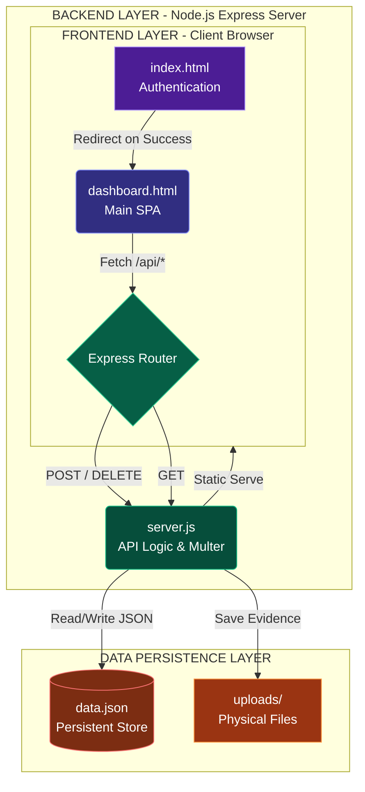

# BuildSphere - Full-Stack System Architecture

A highly modular architecture demonstrating clean frontend, backend, and database separation for institutional telemetry and reporting.

## 🏗 System Architecture

The application enforces strict separation of concerns, communicating exclusively over HTTP REST APIs.



## 🛠 Tech Stack
*   **Frontend**: Vanilla HTML/JS, Tailwind CSS (via CDN), GSAP 3 (Animations), SweetAlert2.
*   **Backend**: Node.js, Express.js, Multer (for file uploads), CORS.
*   **Database**: Local JSON Store (`data.json`) providing zero-dependency disk persistence.

## 🚀 Live Deployment
*   **Render Web Service:** [Click Here to View Live (Placeholder)](#)
*   **Vercel:** [Click Here to View Live (Placeholder)](#)

> [!NOTE]
> **Demo Access Credentials**
> If you are reviewing this repository, you can log in to the authentication portal using the following test credentials:
> - **Username**: `faculty1`
> - **Password**: `pass123`

---

## 💻 Local Setup
Follow these 3 steps to boot the application locally. Since the backend serves the frontend statically, only one terminal is required.

1.  **Clone the Repository**
    ```bash
    git clone https://github.com/CodeWithRJ006/buildsphere.git
    cd buildsphere/BACKEND
    ```

2.  **Install Dependencies**
    ```bash
    npm install
    ```

3.  **Start the Server**
    ```bash
    npm start
    ```
    The app will be available at `http://localhost:3000`.

---

## ☁️ 1-Click Cloud Deployment

The repository comes pre-configured for both **Render** and **Vercel**.

### Deploy to Render (Recommended for Persistence)
Render provides persistent disk support, meaning `data.json` will permanently store your records.
1. Create an account on [Render](https://render.com).
2. Click **New** -> **Blueprint**.
3. Connect this GitHub repository. Render will automatically read the `render.yaml` file, provision a persistent disk, and deploy the full-stack app.

### Deploy to Vercel (Serverless)
Vercel is great for fast frontend hosting and serverless functions.
> [!WARNING]
> Because Vercel is a serverless environment, the local `data.json` file is read-only in production. Data added during a session will not persist across serverless invocations.

1. Create an account on [Vercel](https://vercel.com).
2. Click **Add New** -> **Project**.
3. Import this GitHub repository. Vercel will automatically read `vercel.json` and deploy both the static frontend and the Express backend.
